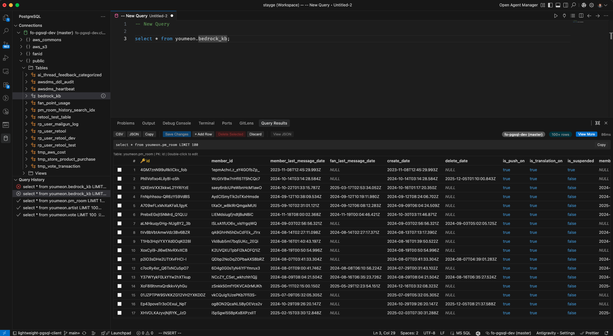
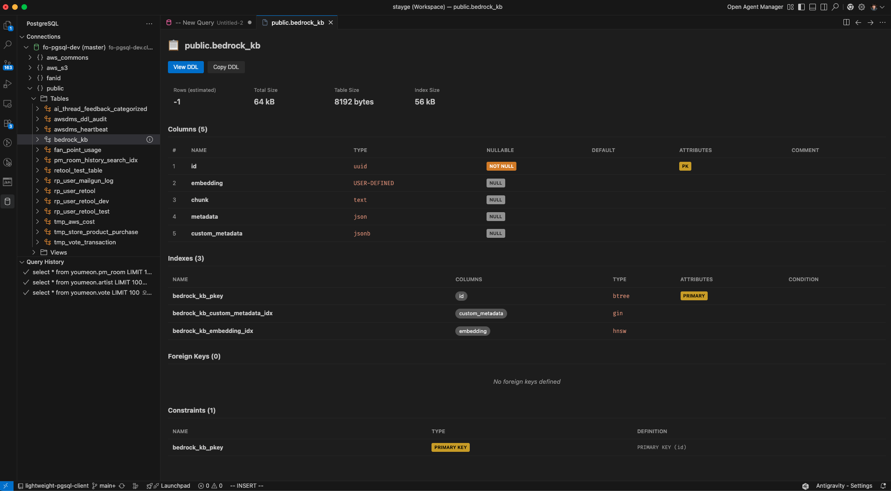

<p align="center">
  
</p>

<h1 align="center">Lightweight PostgreSQL Client</h1>

<p align="center">
  <a href="https://marketplace.visualstudio.com/items?itemName=STAYGELabs.lightweight-pgsql-client"></a>
  <a href="https://open-vsx.org/extension/STAYGELabs/lightweight-pgsql-client"></a>
  <a href="https://opensource.org/licenses/MIT"></a>
</p>

<p align="center">
  A lightweight and fast PostgreSQL client extension for Visual Studio Code.
</p>

## Screenshots




## Why Lightweight PostgreSQL Client?

**Built for developers and operators who work with SQL every day.** This extension focuses on essential features without unnecessary complexity.

### Privacy & Security First

- **Direct connection only** — Connects directly from your machine to your database. No third-party servers, no proxies, no middlemen.
- **Your data stays yours** — Zero data collection, zero telemetry, zero external API calls. Your queries and data never leave your local environment.
- **Secure credential storage** — Passwords are stored in VS Code's built-in Secret Storage, not in plain text config files.

### AI-Powered SQL Writing

- **Works with AI coding assistants** — Fully compatible with Cursor, Antigravity and other AI-powered editors built on VS Code.
- **Leverage AI autocomplete** — Write SQL queries faster with AI-powered code completion and suggestions.
- **Stay in your workflow** — No need to switch between tools. Write, execute, and iterate on queries all in one place.

## Features

### Connection Management

- Save multiple database connections
- Secure password storage using VS Code's Secret Storage
- Connect/disconnect from the sidebar
- Quick connect via connection string

### Query Execution

- Execute SQL queries with `Cmd+Enter` (Mac) / `Ctrl+Enter` (Windows/Linux)
- Document-specific connection binding
- Auto-limit SELECT queries to 100 rows (with "View More" for incremental loading)
- Cancel long-running queries with Cancel button or `PostgreSQL: Cancel Query` command
- SQL comment stripping before execution
- Confirmation dialog for data modification queries (INSERT, UPDATE, DELETE, etc.)

### Schema Explorer

- Browse schemas, tables, and views
- View table structure, indexes, foreign keys, and constraints
- View table DDL
- Copy table names
- Quick "SELECT TOP 100" query generation

### Query Results

- View results in a data grid
- Pagination for large result sets (efficiently handles 90,000+ rows)
- Export to CSV or JSON
- View selected rows as JSON
- Edit data inline (with NULL button support)
- Add/delete rows
- Save changes back to database

### Session Management

- View active database sessions
- Cancel running queries (pg_cancel_backend)
- Terminate sessions (pg_terminate_backend)
- Auto-refresh with configurable interval

### Query History

- Track executed queries
- Re-open queries from history

### SQL Language Features

- Auto-completion for tables and columns
- Hover information for tables
- SQL formatting

## Documentation

- **Quick Start**: [English](docs/quick-start.en.md) | [한국어](docs/quick-start.ko.md)
- **User Manual**: [English](docs/user-manual.en.md) | [한국어](docs/user-manual.ko.md)

## Installation

### From VS Code Marketplace (VSCode)

1. Open VS Code
2. Go to Extensions (`Cmd+Shift+X` / `Ctrl+Shift+X`)
3. Search for "Lightweight PostgreSQL Client"
4. Click Install

Or install directly: [VS Code Marketplace](https://marketplace.visualstudio.com/items?itemName=STAYGELabs.lightweight-pgsql-client)

### From Open VSX (for Cursor, Antigravity, etc.)

1. Open VSCodium or compatible editor
2. Go to Extensions
3. Search for "Lightweight PostgreSQL Client"
4. Click Install

Or install directly: [Open VSX Registry](https://open-vsx.org/extension/STAYGELabs/lightweight-pgsql-client)

### From VSIX File

```bash
code --install-extension lightweight-pgsql-client-x.x.x.vsix
```

## Usage

1. Open the PostgreSQL sidebar (database icon in Activity Bar)
2. Click "+" to add a new connection
3. Enter connection details or paste a connection string
4. Connect to the database
5. Open a `.sql` file or create a new query
6. Execute with `Cmd+Enter` / `Ctrl+Enter`

## Keyboard Shortcuts

| Command       | Mac         | Windows/Linux |
| ------------- | ----------- | ------------- |
| Execute Query | `Cmd+Enter` | `Ctrl+Enter`  |

## Requirements

- VS Code 1.85.0 or higher
- PostgreSQL database

## Extension Settings

- `pgsql.maxRows`: Maximum number of rows to fetch (default: 1000)
- `pgsql.queryTimeout`: Query timeout in milliseconds (default: 30000)

## Known Issues

See [GitHub Issues](https://github.com/StaygeLabs/lightweight-pgsql-client/issues)

## Release Notes

### 0.1.3

- Added extension icon
- Added screenshots to README
- Documented AI coding assistant compatibility (Cursor, Antigravity, etc.)
- Added Open VSX installation instructions
- Added VS Code Marketplace and Open VSX badges

### 0.1.2

- Session management panel - view active sessions, cancel queries, terminate sessions
- Cancel button in editor title bar (shows only when query is running)
- Pagination for large result sets - efficiently handles 90,000+ rows
- "View More" button for incremental loading (100 rows at a time)

### 0.1.1

- Query cancellation support

### 0.1.0

Initial release:

- Connection management with secure password storage
- SQL query execution with document-specific connections
- Schema explorer with table info view
- Query results with inline editing
- Export to CSV/JSON
- Query history
- SQL auto-completion and formatting

## License

MIT
